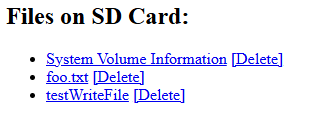
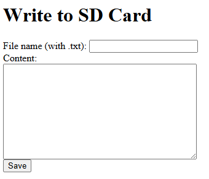
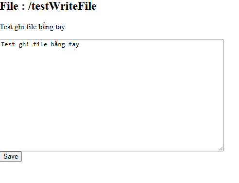

# BTL HỆ NHÚNG

## GIỚI THIỆU

__Đề bài__: _SD card reader._

__Sản phẩm:__
1. Hiển thị danh sách file được ghi trên thẻ, có nút để xóa file
2. Giao diện ghi file mới
3. Giao diện xem nội dung và chỉnh sửa file
- Ảnh chụp minh họa:\
  
  
  
  
  
## TÁC GIẢ

- Tên nhóm: BDP
- Thành viên trong nhóm
  |STT|Họ tên|MSSV|Công việc|
  |--:|--|--|--|
  |1|Trần Duy Phúc|20225378|Lấy thiết bị, làm báo cáo|
  |2|Trịnh Văn Bin|20215530|Lắp mạch, chạy code|
  |3|Nguyễn Việt Dũng|20210227|Lắp mạch, chạy code|
## MÔI TRƯỜNG HOẠT ĐỘNG
_Liệt kê module CPU/dev kit.
| Thiết bị                                    | Mô tả                                                                                                                                                                                               |
| ------------------------------------------- | --------------------------------------------------------------------------------------------------------------------------------------------------------------------------------------------------- |
| **ESP32 DevKit V1** | Bo mạch phát triển dựa trên vi điều khiển **ESP32-WROOM-32** của hãng Espressif. Tích hợp WiFi, Bluetooth, nhiều chân GPIO, hỗ trợ giao tiếp SPI, UART, PWM... Là phần cứng trung tâm của hệ thống. |


_Liệt kê các kit, module được sử dụng: 
| Module / Kit                                  | Vai trò                                                                                 | Giao tiếp                  |
| --------------------------------------------- | --------------------------------------------------------------------------------------- | -------------------------- |
| **Module thẻ nhớ OKY3001**                    | Giao tiếp với thẻ **microSD** và chuyển đổi tín hiệu SPI giữa ESP32 và thẻ nhớ.         | SPI                        |
| **Thẻ nhớ microSD (4GB–16GB, Class 10)**      | Thiết bị **lưu trữ dữ liệu**: ghi và đọc các file do người dùng tạo trên web.           | Cắm vào module OKY3001     |
| **Cáp USB–MicroUSB**                          | Dùng để **nạp chương trình** và **quan sát log UART** từ ESP32 lên máy tính.            | UART (qua chip chuyển USB) |
| **PC/Laptop**                 | Thiết bị **máy trạm**, truy cập vào Web Server do ESP32 tạo ra để tương tác với thẻ SD. | WiFi (HTTP)                |


## SO ĐỒ SCHEMATIC

_Cho biết cách nối dây, kết nối giữa các linh kiện_ 
| Chân MicroSD card module | Chân kết nối tương ứng trên ESP32 |
| ------------------------ | --------------------------------- |
| 5V                       | 5V                                |
| CS                       | GPIO 5                            |
| MOSI                     | GPIO 23                           |
| CLK                      | GPIO 18                           |
| MISO                     | GPIO 19                           |
| GND                      | GND                               |


### TÍCH HỢP HỆ THỐNG
_Mô tả các thành phần phần cứng và vai trò của chúng: 
| Thành phần                           | Mô tả & Vai trò                                                                                                                                  |
| ------------------------------------ | ------------------------------------------------------------------------------------------------------------------------------------------------ |
| **ESP32 (thiết bị IoT)**             | Là trung tâm hệ thống. Thực hiện các nhiệm vụ chính: tạo Web Server, giao tiếp với thẻ nhớ SD qua SPI, xử lý các yêu cầu từ người dùng qua WiFi. |
| **Thẻ nhớ microSD + module OKY3001** | Thiết bị lưu trữ dữ liệu. Kết nối với ESP32 qua giao tiếp SPI. Cho phép đọc, ghi, xoá file từ Web Server.                                        |
| **Máy trạm (PC/Laptop/Điện thoại)**  | Thiết bị truy cập vào Web Server của ESP32 thông qua trình duyệt. Người dùng sử dụng giao diện web để tương tác với thẻ nhớ SD từ xa.            |
| **WiFi Router**                      | Trung gian truyền thông không dây giữa ESP32 và máy trạm. Giúp các thiết bị trong mạng LAN giao tiếp với nhau qua giao thức HTTP.                |

  _Mô tả các thành phần phần mềm và vai trò của chúng, vị trí nằm trên phần cứng nào:
  | Thành phần                         | Mô tả                                                                                                                                                         | Chạy trên                                   |
| ---------------------------------- | ------------------------------------------------------------------------------------------------------------------------------------------------------------- | ------------------------------------------- |
| **Front-end (giao diện Web)**      | Giao diện người dùng HTML được tạo và gửi từ ESP32. Cho phép người dùng nhập tên file, nội dung, xem danh sách, tải về, chỉnh sửa hoặc xoá file trên thẻ nhớ. | Trình duyệt web trên **máy trạm**           |
| **Back-end (Web Server ESP32)**    | Là logic phía ESP32: xử lý các HTTP request từ trình duyệt, thực hiện thao tác đọc/ghi/xoá file, tạo nội dung HTML động để phản hồi.                          | Chạy trên **ESP32**                         |
| **FATFS (Middleware)**             | Thư viện hệ thống tập tin FAT dùng để thao tác với thẻ nhớ SD: mở file, đọc/ghi dữ liệu, duyệt thư mục...                                                     | Tích hợp trong phần mềm chạy trên **ESP32** |
| **WiFi Stack / WebServer Library** | Giao tiếp mạng WiFi, lắng nghe các kết nối TCP từ client, quản lý các route (/, /write, /download, /delete...)                                                | **ESP32**                                   |
| *(Tuỳ chọn)* **Serial Monitor**    | Dùng để theo dõi log hệ thống như quá trình khởi tạo WiFi, SD, thông báo lỗi...                                                                               | **PC** qua UART                             |


### ĐẶC TẢ HÀM

- Giải thích một số hàm quan trọng: ý nghĩa của hàm, tham số vào, ra

  ```C
    /**
     *  Hàm xử lý khi truy cập trang chủ của Web Server.
     *  Hiển thị giao diện HTML cho phép:
     *  - Ghi file lên thẻ SD
     *  - Hiển thị danh sách file đang có trên thẻ SD
     *  - Tạo link để xem/xóa từng file
     *  @return Không có
     */
    void handleRoot();


    /**
     *  Hàm xử lý ghi nội dung từ form HTML vào file trên thẻ nhớ SD.
     *  Lấy thông tin từ POST: filename và content.
     *  @return Không có, phản hồi HTML thông báo kết quả lên trình duyệt
     */
    void handleWriteFile();

    /**
     *  Xử lý việc tải file từ trình duyệt lên thẻ nhớ SD.
     *  - Khi người dùng chọn file và nhấn "Upload" trên giao diện web, trình duyệt sẽ gửi dữ liệu qua HTTP POST.
     *  - Hàm này sẽ lắng nghe quá trình upload, tạo file mới trên thẻ nhớ, và ghi dữ liệu dần vào file.
     *
     *  @note Yêu cầu form HTML có thuộc tính: `enctype='multipart/form-data'`
     *  @attention Phải khai báo biến `uploadFile` kiểu `File` ở phạm vi toàn cục.
     */
    void handleFileUpload();


   /**
     *  Hàm xử lý yêu cầu xem nội dung file từ thẻ nhớ SD.
     *  Đọc file được chỉ định từ tham số GET `file`.
     *  Hiển thị nội dung file dưới dạng HTML và cho phép chỉnh sửa rồi lưu lại.
     *  @return Không có
     */
    void handleDownload();


    /**
     *  Hàm xử lý xóa file từ thẻ nhớ SD.
     *  Lấy tên file cần xóa từ tham số GET `file`.
     *  @return Không có, chuyển hướng trình duyệt về trang chủ sau khi xóa
     */
    void handleDelete();


    /**
     *  Hàm khởi tạo hệ thống.
     *  - Kết nối WiFi
     *  - Khởi tạo thẻ nhớ SD
     *  - In thông tin thẻ nhớ lên Serial
     *  - Cài đặt các route HTTP cho Web Server
     *  - Bắt đầu server
     *  @return Không có
     */
    void setup();


   /**
     *  Vòng lặp chính của chương trình.
     *  - Duy trì hoạt động của Web Server
     *  @return Không có
     */
    void loop();

  

 
  ```
  
### KẾT QUẢ

👉 [Xem video kết quả](https://drive.google.com/uc?export=preview&id=1hFZB-HULwBDwqMSNlD8-usERkxRHlSB2)

